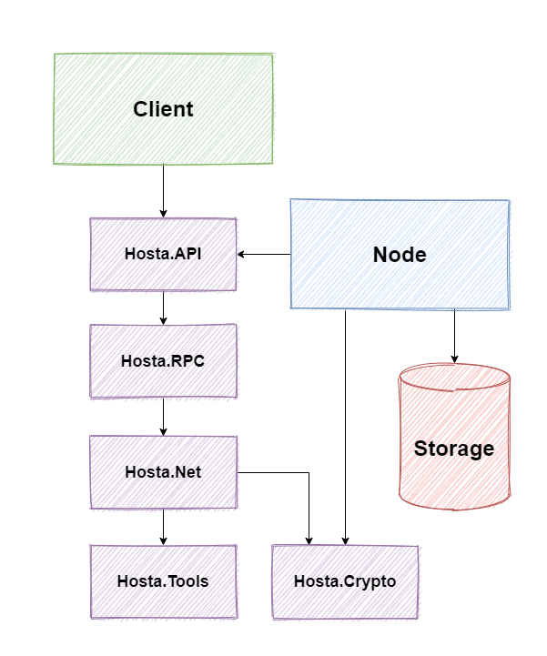
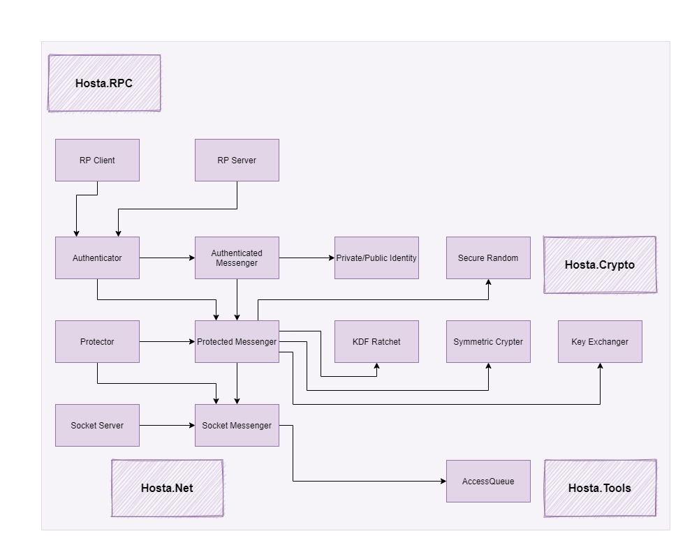

<h4 align="center">
  
</h4>

<h3 align="center">
  Take back control of your data
</h3>

  Hosta is an open source, PoC decentralized social media that focuses on privacy, security, and real-world relationships.

<h3 align="center">
 📝 🔒 👪
</h3>

<h1/>

<h4 align="center">
  
  
  
  
  
  
  
</h4>

<h3 align="center">
  <a href="https://github.com/mileswatson/Hosta/tree/master/src">Source</a>
   · 
  <a href="https://github.com/mileswatson/Hosta/wiki">Docs</a>
   · 
  <a href="https://github.com/mileswatson/Hosta/discussions/21">Feature request</a>
   · 
  <a href="https://github.com/mileswatson/Hosta/issues">Report a bug</a>
   · 
  <a href="https://github.com/mileswatson/Hosta/discussions/20">Support</a>
</h3>

<h1/>

## What's the problem?

Modern social media platforms rely on personalised advertising. They are designed with two purposes:

1. 📋 Collect and analyse as much user-data as possible
2. ⌚ Keep the user engaged as long as possible

This leads to a time-consuming and stressful user experience that is fraught with relentless notifications, addictive recommendation algorithms, dangerous echo-chambers, and harmful fixations on numbers (likes, followers etc).

## How is Hosta different?

Hosta is a different type of social media to the ones you usually install on your phone. By using the Hosta network:

 - Users are in direct control of their data
 - All communications are end-to-end encrypted
 - There is no central server that controls the network

All of this makes Hosta ideal for private, secure, and censorship resistant communications.

## What do I need to get started?

To get started, you need an always-on device to host your content on. You can use a desktop, but the recommendation is to use a Raspberry Pi running Ubuntu or similar.

You will also need a device that supports the Hosta application. At the moment, this is limited to a desktop running the latest version of Windows - however, more platforms may be available in the future.

## DNS

Will try to make it as far as possible:
1. Manual IP entry
2. Full mesh
3. Recursive lookup via adjacent nodes
4. a) DHT, perhaps similar to Kademlia's implementation; b) blockchain

## Architecture

This is the proposed structure of the network. Each client has a corresponding node, which hosts their content and contains the public key. The nodes update each other of their location, which means that the client only has to know the location of one node on the network to be able to connect.

The solution is divided into 4 main projects - a client program, a node program, a database, and a core library (used by both the client and the node).

Here is the progress on the core library so far:

