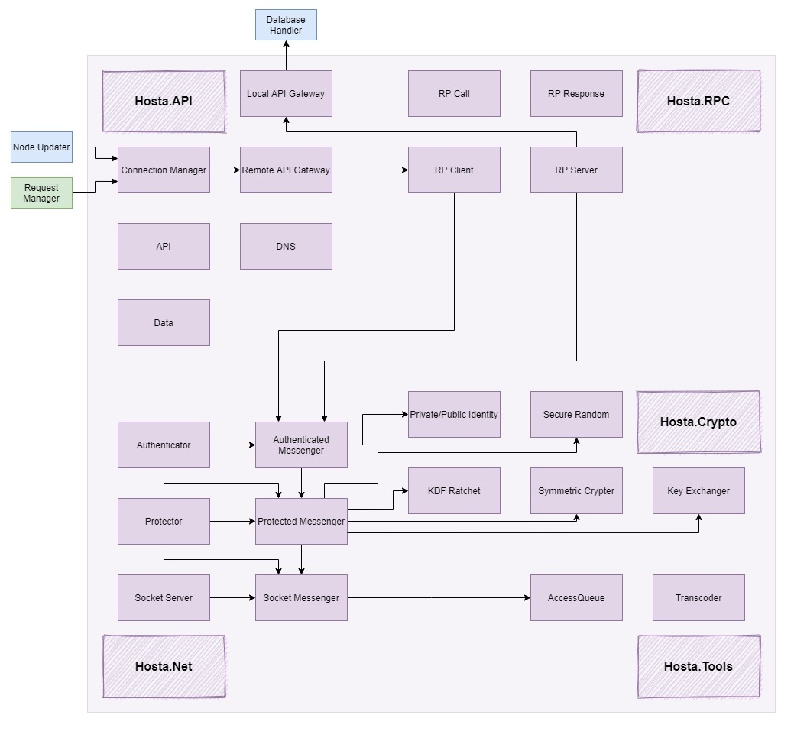

<h3 align="center">
  
</h3>

<h3 align="center">
  Take back control of your data
</h3>

  Hosta is an open source, PoC decentralized social media that focuses on privacy, security, and real-world relationships.

 📝 🔒 👪

<h1></h1> 

  
  
  
  
  
  
  

<h3 align="center">
  <a href="https://github.com/mileswatson/Hosta/tree/master/src">Source</a>
   · 
  <a href="https://github.com/mileswatson/Hosta/wiki">Docs</a>
   · 
  <a href="https://github.com/mileswatson/Hosta/discussions/21">Feature request</a>
   · 
  <a href="https://github.com/mileswatson/Hosta/issues">Report a bug</a>
   · 
  <a href="https://github.com/mileswatson/Hosta/discussions/20">Support</a>
</h3>

<h1></h1>

### What's the problem?

Modern social media platforms rely on *personalised advertising*. They are designed with two purposes:

1. 📋 Collect and analyse as much user-data as possible
2. ⌚ Keep the user engaged as long as possible

This leads to a *time-consuming* and *stressful* user experience that is fraught with relentless notifications, addictive recommendation algorithms, dangerous echo-chambers, and harmful fixations on numbers (likes, followers etc).

### How is Hosta different?

Hosta is a different type of social media to the ones you usually install on your phone. By using the Hosta network:

 - Users are in **direct control** of their data
 - All communications are **end-to-end encrypted**
 - There is **no central server** that controls the network

All of this makes Hosta ideal for private, secure, and censorship resistant communications.

Furthermore, Hosta is not incentivised to maximise user attention - there are no intrusive advertisements, no greedy shareholders, and no creepy trackers.

### What do I need to get started?

Each user should have an always-on-device (called a *node*) to host their content on. The node controls all of the user's data - it stores posts and comments, and controls who can see them. For beginners, a **Raspberry Pi + Ubuntu** is recommended.

They can use a *client* program to view the posts, comments, and profiles of users on the network. At the moment, only a **Windows 32/64 bit** client is in the works - however, more platforms may be supported in the future.

# The Technical Bit

In this section, I will do my best to explain the inner workings of the project.

### Contents

 - [Technologies](#technologies)
 - [Network Architecture](#network-architecture)
 - [Solution Structure](#solution-structure)
 - [Hosta (Core Library)](#hosta-core-library)
   - [Crypto](#crypto)
   - [Tools](#tools)
   - [Net](#net)
   - [RPC](#rpc)
   - [API](#api)

## Technologies

This project using the following languages / frameworks:
 - [**C# 9**](https://docs.microsoft.com/en-us/dotnet/csharp/)
 - [**.NET 5**](https://devblogs.microsoft.com/dotnet/introducing-net-5/)
 - [**WPF**](https://docs.microsoft.com/en-us/visualstudio/designers/getting-started-with-wpf?view=vs-2019) (desktop)
 - [**SQLite**](https://sqlite.org/index.html) (node)

It also uses the following NuGet packages:
 - [**Json.NET**](https://www.newtonsoft.com/json) - fast and reliable JSON serialization
 - [**sqlite-net**](https://github.com/praeclarum/sqlite-net) - a simple, cross platform ORM for SQLite

Many thanks to the library maintainers for making this project possible!

## Network Architecture

As mentioned earlier, there are two classes of device on the Hosta network.

1. **Nodes** - always-on servers, responsible for controlling the data of a user
2. **Clients** - user interfaces, responsible for fetching and displaying data from nodes

A sample architecture is shown below, with each user having a node and a single client.

### User IDs

Each user is identified by a unique hex ID.

### IDAR

> **Id**entity **A**ddress **R**esolver
> 
>  Responsible for finding the node address of a given ID (a replacement for traditional DNS)

As nodes have a high uptime, they help power the IDAR service. When a client wishes to get the location of a friend's node, they will ask their own node for the address. Their own node will then resolve the query, returning the address to the client.

There are five main mechanisms that IDAR could use, in order of increasing complexity:
 - [x] Manual IP entry (impractical)
 - [ ] Full mesh broadcasting (heavy on storage)
 - [ ] Friend broadcasting w/ recursive lookup (light on storage, but very vulnerable to partitions)
 - [ ] Blockchain (less vulnerable to partitions, but heavy on the CPU)
 - [ ] Distributed hash table (light on storage, efficient queries, but hard to implement)

The ones that have been implemented have been ticked off.

## Solution Structure

The solution is divided into 3 main projects - a client application, a node program, and a core library (used by both the client and the node).

> Note: Consider "x->y" to mean "x is dependant on y and y is not dependant on x".
> 
> "x->y->z" => "x->z"

## Hosta (Core Library)

Here is a diagram of the library so far:

I will now go through each of the parts of the namespace, from the ground up.

### Crypto

The `Hosta.Crypto` sub-namespace handles the common cryptographic operations across the namespace. It uses the following primitives from `System.Security.Cryptography`:
 - [AesGcm](https://docs.microsoft.com/en-us/dotnet/api/system.security.cryptography.aesgcm?view=net-5.0) - symmetric encryption
 - [RandomNumberGenerator](https://docs.microsoft.com/en-us/dotnet/api/system.security.cryptography.randomnumbergenerator?view=net-5.0) - CSPRNG
 - [ECDH](https://docs.microsoft.com/en-us/dotnet/api/system.security.cryptography.ecdiffiehellman?view=net-5.0) - key exchanging
 - [ECDsa](https://docs.microsoft.com/en-us/dotnet/api/system.security.cryptography.ecdsa?view=net-5.0) - digital signatures
 - [HMACSHA512](https://docs.microsoft.com/en-us/dotnet/api/system.security.cryptography.hmacsha512?view=net-5.0) - symmetric ratcheting
 - [SHA256](https://docs.microsoft.com/en-us/dotnet/api/system.security.cryptography.sha256?view=net-5.0) - hashing

### Tools

The `Hosta.API` sub-namespace provides commonly used tools. At the moment, these include:
 - `AccessQueue`
   - an asynchronous queue, used to control access to a resource
 - `Transcoder`
   - provides text encoding / decoding functionality

### Net

The `Hosta.Net` sub-namespace builds upon `System.Net.Sockets` to allow secure, authenticated, message-based (as opposed to stream-based) communication.

It uses a "layer" structure:
 - `Socket[Client/Server/Messenger]`
   - wraps the default `Socket` APM functions with TAP functions
   - splits the socket stream into messages (using length prefixing)
 - `Protected[Client/Server/Messenger]`
   - performs an ECDH key exchange
   - encrypts the connection using AES GCM
   - provides backwards secrecy with KDF Ratchets (forwards secrecy may yet be implemented)
 - `Authenticated[Client/Server/Messenger]`
   - allows a client and server to authenticate each other
   - translates between strings and byte arrays

This layer structure allows resilient and reliable communications, without relying on tradional methods (such as certificate authorities or 2WSSL).

> Disclaimer: Don't use the Protected or Authenticated classes for anything serious, as I understand enough about cryptography to realise I know nothing :)

### RPC

The `Hosta.RPC` sub-namespace builds upon `Hosta.NET` to allow for remote procedure calls in the form of `Call(string proc, string args)`.

It consists of two main classes:
 - `RPServer`
   - receives `RPCall`s and forwards them to a given ICallable
   - sends back an `RPResponse` when the call has finished
 - `RPClient`
   - allows a client to send an `RPCall` to the server
   - returns the result from an `RPResponse` when the call has finished (or throws an exception if remote execution failed)

### API

The `Hosta.API` sub-namespace provides the main functionality for the library, by building off `Hosta.RPC`.

There are three main classes:
 - `API`
   - an abstract class which acts specifies the remote procedures which can be called on the node
 - `RemoteAPIGateway`
   - translates `RPCall`s into actual `API` function calls
   - translates the result into an `RPResponse`
 - `LocalAPIGateway`
   - translates `API` function calls into `RPCall`s
   - translates any `RPResponse`s into actual results

There is also a `Hosta.API.Data` sub-namespace which specifies the data structures for API requests and responses.